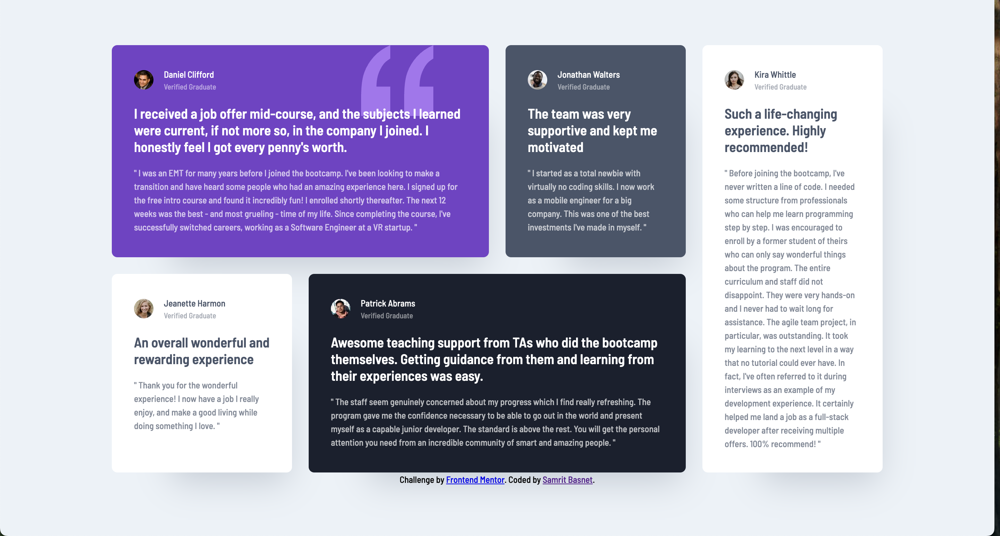

# Frontend Mentor - Testimonials grid section solution

This is a solution to the [Testimonials grid section challenge on Frontend Mentor](https://www.frontendmentor.io/challenges/testimonials-grid-section-Nnw6J7Un7). Frontend Mentor challenges help you improve your coding skills by building realistic projects.

### The challenge

Users should be able to:

- View the optimal layout for the site depending on their device's screen size

### Screenshot



**Note: Delete this note and the paragraphs above when you add your screenshot. If you prefer not to add a screenshot, feel free to remove this entire section.**

### Links

- Solution URL: [Add solution URL here](https://github.com/samritbasnet/Testimonials-grid-section)

## My process

### Built with

- Semantic HTML5 markup
- CSS custom properties
- Flexbox
- CSS Grid

### What I learned

I learned how to create responsive layouts using CSS Grid and Flexbox, allowing for complex designs that adapt to different screen sizes. Key techniques include positioning elements with grid-column and grid-row, styling with properties like border-radius, box-shadow, and opacity, and managing typography for readability.

To see how you can add code snippets, see below:

```html
<h1>Some HTML code I'm proud of</h1>
```

`
.card p {
font-size: 13px;
line-height: 1.5;
opacity: 70%;
}

.card-container {
display: grid;
grid-template-columns: repeat(4, 1fr);
gap: 24px;
max-width: 1110px;
margin: 0 auto;
}
.daniel{
background-color: hsl(263, 55%, 52%);
color: white;
grid-column: 1 / span 2;
background-image: url('./images/bg-pattern-quotation.svg');
background-repeat: no-repeat;
background-position: top right 80px;

}

```


```

## Author

- Website - [Add your name here](https://www.your-site.com)
- Frontend Mentor - [@yourusername](https://www.frontendmentor.io/profile/Samritbasnet)
- Twitter - [@yourusername](https://www.twitter.com/Samritbasnet70)

**Note: Delete this note and add/remove/edit lines above based on what links you'd like to share.**
